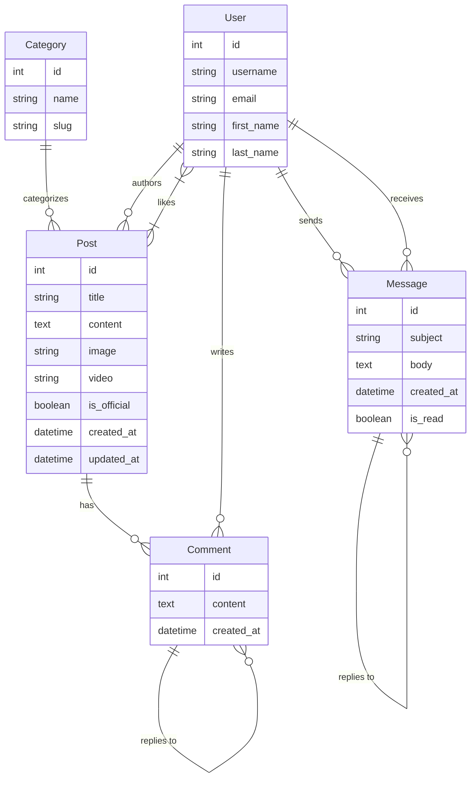

# Heritage Auto

Sistema voltado para o público entusiasta do mundo automobilístico e motociclismo. A plataforma oferece um espaço para notícias oficiais, feed da comunidade, interações sociais e um sistema de mensagens diretas entre usuários.

## Funcionalidades do Sistema

- **Feed de Notícias e Comunidade**: Visualize notícias oficiais e postagens da comunidade em uma interface moderna.
- **Postagens**: Usuários podem criar postagens com títulos, conteúdo, imagens ou vídeos.
- **Interação Social**: Sistema de curtidas e comentários em postagens.
- **Mensagens (Chat)**: Sistema de mensagens estilo "conversa" entre usuários, com atualizações em tempo real (polling) e suporte a respostas.
- **Busca de Usuários**: Autocomplete para encontrar outros usuários para iniciar conversas.
- **Autenticação**: Cadastro e login de usuários.

## Ferramentas Utilizadas

- **Backend**: Django 5.0, Django REST Framework (DRF).
- **Frontend**: Django Templates, Alpine.js (para interatividade e consumo de API), Tailwind CSS (estilização).
- **Banco de Dados**: SQLite.
- **Outros**: `pillow` (processamento de imagens), `django-filter`.

## Estrutura de Arquivos

O projeto segue a estrutura solicitada com `core` para configurações e `app` para a lógica de negócios. Abaixo estão os caminhos principais:

- **Configurações do Projeto (Core)**: `core/`
- **Lógica da Aplicação**: `app/`
- **Templates HTML**: `app/templates/`
- **Scripts Alpine.js/JS e Tailwind**: `static/` (subpastas: `home/`, `messages/`, `js/`, `posts/`, `layouts`)
- Fixtures (Dados): `app/fixtures/`

## Diagrama de Entidade e Relacionamento (DER)



## Categorias
- Clássicos
- Harley Davidson
- Formula 1
- Le Mans
- Games e Simuladores
- Novidades do Mercado
- Carros e Motos de Luxo

## Instalação e Inicialização

1. **Crie e ative o ambiente virtual:**
   ```bash
   # Criar o ambiente virtual
   python -m venv .venv

   # Ativar no Windows
   .venv\Scripts\activate

   # Ativar no Linux/Mac
   source .venv/bin/activate
   ```

2. **Instale as dependências:**
   ```bash
   pip install -r requirements.txt
   ```

3. **Execute as migrações:**
   ```bash
   python manage.py migrate
   ```

4. **Carregue os dados iniciais (Fixtures):**
   O projeto conta com uma fixture contendo dados de exemplo (categorias, posts, usuários).
   ```bash
   python manage.py loaddata app/fixtures/initial_data.json
   ```

5. **Crie um superusuário (Opcional):**
   ```bash
   python manage.py createsuperuser
   ```

6. **Execute o servidor:**
   ```bash
   python manage.py runserver
   ```

## API Endpoints

O sistema utiliza uma API REST para diversas funcionalidades dinâmicas. Abaixo estão os principais endpoints:

### Posts e Interações
- `GET /api/posts/`: Lista postagens (suporta filtro `?is_official=true/false`).
- `GET /api/posts/<id>/`: Detalhes de uma postagem.
- `POST /api/posts/<id>/like/`: Curtir/Descurtir uma postagem.
- `POST /api/posts/<id>/comment/`: Adicionar um comentário.
- `GET /api/categories/`: Lista todas as categorias.

### Mensagens e Usuários
- `GET /api/users/search/?q=<query>`: Busca usuários por nome (autocomplete).
- `GET /api/messages/`: Lista conversas do usuário.
- `POST /api/messages/`: Envia uma nova mensagem.
- `GET /api/messages/conversation/<username>/`: Obtém o histórico de mensagens com um usuário específico.
- `DELETE /api/messages/<id>/`: Apaga uma mensagem (apenas o remetente).

